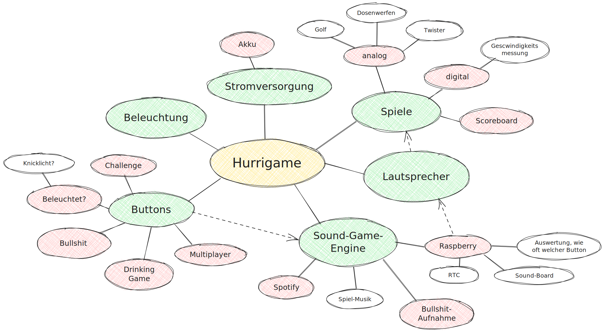

# Hurrigame
The sound-game enginge for the Hurricane festival. Works for other festivals too. May cause fun and consumption of alcohol.



## Enable Bluetooth connection

Tested on Raspberry OS 12 (bookworm) and a Raspberry Pi 4B.

Works probably best on a fresh install. 

Follow https://github.com/nicokaiser/rpi-audio-receiver to enable bluetooth audio.

## Audio control using Python

### Install dependencies in virtual environment

After trying to pip install pulsectl, the pi recommended me to install it in a virtual environment. So I did.

```bash
python -m venv ~/hurrienv
source ~/hurrienv/bin/activate
pip install -r requirements.txt
```

### Scripts

The audio subfolder contains scripts to control the audio output of the Raspberry Pi. WIP.

### Sound copyright

'yeah-18130.mp3' for testing and debugging from <a href="https://pixabay.com/?utm_source=link-attribution&utm_medium=referral&utm_campaign=music&utm_content=18130">Pixabay</a>